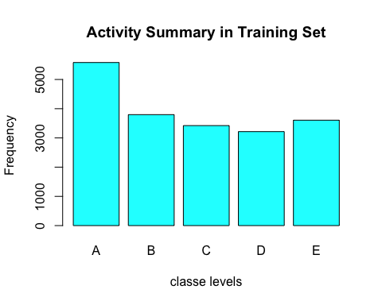
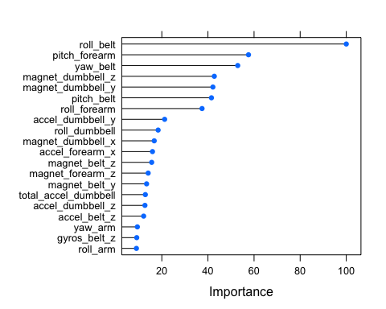

# Practical Machine Learning - Prediction Assignment
Vishanta Rayamajhi  
November 21, 2015  

##Background
As part of the course project for **Practical Machine Learning** in Coursera, we were provided with a training and a testing set of activity data of six young health participants, collected from accelerometers on the belt, forearm, arm, and dumbell, where each participants were asked to perform barbell lifts correctly and incorrectly in 5 different ways. 

##Goal
The goal of the project is to predict the manner in which the participants did the exercise. Build a predictive model to be able to predict the outcome 'classe' in the testing set that falls in one of the following classes:

- Exactly according to the specification (Class A)
- Throwing the elbows to the front (Class B)
- Lifting the dumbbell only halfway (Class C)
- Lowering the dumbbell only halfway (Class D)
- Throwing the hips to the front (Class E)

##Loading data
The data is downloaded and stored in the 'data' directory. We load the data by changing the missing values those that are coded as string "#DIV/0!" or "" to "NA" in order to maintain uniformity with missing values.

```r
# Load training set
pml_training <- read.csv("data/pml-training.csv", na.strings=c("NA","#DIV/0!", ""))

# Load testing set
pml_testing <- read.csv("data/pml-testing.csv", na.strings=c("NA","#DIV/0!", ""))
```

##Load library

```r
library(caret)
```

```
## Loading required package: lattice
## Loading required package: ggplot2
```

```r
library(doParallel)
```

```
## Loading required package: foreach
## Loading required package: iterators
## Loading required package: parallel
```

##Data structure

```r
dim(pml_training)
```

```
## [1] 19622   160
```

```r
dim(pml_testing)
```

```
## [1]  20 160
```

```r
table(pml_training$user_name)
```

```
## 
##   adelmo carlitos  charles   eurico   jeremy    pedro 
##     3892     3112     3536     3070     3402     2610
```

```r
table(pml_training$classe)
```

```
## 
##    A    B    C    D    E 
## 5580 3797 3422 3216 3607
```

```r
table(pml_training$classe, pml_training$user_name)
```

```
##    
##     adelmo carlitos charles eurico jeremy pedro
##   A   1165      834     899    865   1177   640
##   B    776      690     745    592    489   505
##   C    750      493     539    489    652   499
##   D    515      486     642    582    522   469
##   E    686      609     711    542    562   497
```

##Cleaning Data
The preliminary study of the summary of the training set reveals more insight of the structure of the data which enables us to come up with a number of cleaning actions below:

- Remove not relevant columns for classification (the first 7 columns)
- Remove columns with over 95% of NAs
- Exclude near zero variance predictors
- Convert dependent variable "classe" into factor, if not

Let's first check the columns with NA values before proceeding with cleaning the data.


```r
summary(colSums(is.na(pml_training)) == 0)
```

```
##    Mode   FALSE    TRUE    NA's 
## logical     100      60       0
```

The result shows we have 100 columns with zero variability, which could be excluded in our prediction model.


```r
# Remove the first 7 columns
training.set <- pml_training[,-c(1:7)] ## 153 covariants

# Remove missing data
NAs <- apply(training.set, 2, function(x) {sum(is.na(x))})
training.set <- training.set[,which(NAs < nrow(training.set)*0.95)] ## 53 covariants

# Exclude near zero variance predictors
table(nearZeroVar(training.set, saveMetrics = TRUE)$nzv) # FALSE=53, implies no nzv due to data cleaning
```

```
## 
## FALSE 
##    53
```

```r
nzv.columns <- nearZeroVar(training.set, saveMetrics = TRUE)
training.set <- training.set[,nzv.columns$nzv == FALSE] # takes the 53 'FALSE' columns

# Convert classe into factor
training.set$classe <- factor(training.set$classe)
```

##Feature Selection
The final set of features used for classification are as follows.

```r
names(training.set)
```

```
##  [1] "roll_belt"            "pitch_belt"           "yaw_belt"            
##  [4] "total_accel_belt"     "gyros_belt_x"         "gyros_belt_y"        
##  [7] "gyros_belt_z"         "accel_belt_x"         "accel_belt_y"        
## [10] "accel_belt_z"         "magnet_belt_x"        "magnet_belt_y"       
## [13] "magnet_belt_z"        "roll_arm"             "pitch_arm"           
## [16] "yaw_arm"              "total_accel_arm"      "gyros_arm_x"         
## [19] "gyros_arm_y"          "gyros_arm_z"          "accel_arm_x"         
## [22] "accel_arm_y"          "accel_arm_z"          "magnet_arm_x"        
## [25] "magnet_arm_y"         "magnet_arm_z"         "roll_dumbbell"       
## [28] "pitch_dumbbell"       "yaw_dumbbell"         "total_accel_dumbbell"
## [31] "gyros_dumbbell_x"     "gyros_dumbbell_y"     "gyros_dumbbell_z"    
## [34] "accel_dumbbell_x"     "accel_dumbbell_y"     "accel_dumbbell_z"    
## [37] "magnet_dumbbell_x"    "magnet_dumbbell_y"    "magnet_dumbbell_z"   
## [40] "roll_forearm"         "pitch_forearm"        "yaw_forearm"         
## [43] "total_accel_forearm"  "gyros_forearm_x"      "gyros_forearm_y"     
## [46] "gyros_forearm_z"      "accel_forearm_x"      "accel_forearm_y"     
## [49] "accel_forearm_z"      "magnet_forearm_x"     "magnet_forearm_y"    
## [52] "magnet_forearm_z"     "classe"
```

##Exploratory Data Analysis (EDA)

```r
plot(training.set$classe,
     col="cyan",
     main="Activity Summary in Training Set",
     xlab="classe levels",
     ylab="Frequency"
)
```

 

##Cross validation: Splitting data
Split the dataset into 60% training and 40% validation set in order to perform cross validation. This is performed using random sampling without replacement.


```r
inTrain <- createDataPartition(y=training.set$classe, p=0.60, list=FALSE)
training <- training.set[inTrain,]
validation <- training.set[-inTrain,]
```

##Fit a Model
We will be using a couple of model and find out the one that provides high accuracy and low out of sample error. The Principal Component Analysis (PCA) can also be added as a preprocess option of the train function, but at the expense of losing accuracy. Hence, we will omit PCA model.


```r
# set a seed
set.seed(6789)
```

**Random Forest**
When I first ran the Random Forest model with default train() function, it seemed to take hours to complete the run. I stopped the exeuction in the middle. The first thing to note is that by default {caret}train() uses "Resampling: Bootstraped" which is very computationally intensive.

1. Hence, I used optimization method using trControl parameter for tuning model training. And switched to cross-validation (Resampling: Cross-Validated) with a low k=3, and played around with it to get a compromise between accuracy and speed. With this the model completed in approx 6 mins.

2. In the next run, I used parallel computing for multi-core using registerDoParallel(). The 4-core CPU were fully utilized and it completed in less than 3 mins.

**Tuning with cross validation**
The model is tuned with cross validation resampling (Resampling: Cross-Validated) with 3 folds. Parallel computing method is also applied to improve efficiency.


```r
# parallel computing for multi-core
registerDoParallel(makeCluster(detectCores()))

# train a model - random forest (rf)
modelRF <- train(classe ~ ., data=training, method="rf", trControl = trainControl(method = "cv", number = 3))
```

```
## Loading required package: randomForest
## randomForest 4.6-12
## Type rfNews() to see new features/changes/bug fixes.
```

```r
modelRF
```

```
## Random Forest 
## 
## 11776 samples
##    52 predictor
##     5 classes: 'A', 'B', 'C', 'D', 'E' 
## 
## No pre-processing
## Resampling: Cross-Validated (3 fold) 
## Summary of sample sizes: 7849, 7851, 7852 
## Resampling results across tuning parameters:
## 
##   mtry  Accuracy   Kappa      Accuracy SD   Kappa SD    
##    2    0.9865830  0.9830250  0.0007740313  0.0009802971
##   27    0.9878567  0.9846371  0.0012563796  0.0015905969
##   52    0.9809780  0.9759331  0.0029334779  0.0037193322
## 
## Accuracy was used to select the optimal model using  the largest value.
## The final value used for the model was mtry = 27.
```

```r
modelRF$finalModel
```

```
## 
## Call:
##  randomForest(x = x, y = y, mtry = param$mtry) 
##                Type of random forest: classification
##                      Number of trees: 500
## No. of variables tried at each split: 27
## 
##         OOB estimate of  error rate: 0.83%
## Confusion matrix:
##      A    B    C    D    E class.error
## A 3344    2    1    0    1 0.001194743
## B   21 2251    7    0    0 0.012286090
## C    0   12 2031   11    0 0.011197663
## D    0    0   25 1902    3 0.014507772
## E    0    2    5    8 2150 0.006928406
```

```r
# prediction
predictions <- predict(modelRF, newdata = validation)
```

```r
# quick checks
table(validation$classe)
```

```
## 
##    A    B    C    D    E 
## 2232 1518 1368 1286 1442
```

```r
table(predictions)
```

```
## predictions
##    A    B    C    D    E 
## 2242 1523 1366 1278 1437
```

```r
# confusion matrix
confusionMatrix(predictions, validation$classe)
```

```
## Confusion Matrix and Statistics
## 
##           Reference
## Prediction    A    B    C    D    E
##          A 2231   11    0    0    0
##          B    1 1506   14    1    1
##          C    0    1 1351   11    3
##          D    0    0    3 1274    1
##          E    0    0    0    0 1437
## 
## Overall Statistics
##                                          
##                Accuracy : 0.994          
##                  95% CI : (0.992, 0.9956)
##     No Information Rate : 0.2845         
##     P-Value [Acc > NIR] : < 2.2e-16      
##                                          
##                   Kappa : 0.9924         
##  Mcnemar's Test P-Value : NA             
## 
## Statistics by Class:
## 
##                      Class: A Class: B Class: C Class: D Class: E
## Sensitivity            0.9996   0.9921   0.9876   0.9907   0.9965
## Specificity            0.9980   0.9973   0.9977   0.9994   1.0000
## Pos Pred Value         0.9951   0.9888   0.9890   0.9969   1.0000
## Neg Pred Value         0.9998   0.9981   0.9974   0.9982   0.9992
## Prevalence             0.2845   0.1935   0.1744   0.1639   0.1838
## Detection Rate         0.2843   0.1919   0.1722   0.1624   0.1832
## Detection Prevalence   0.2858   0.1941   0.1741   0.1629   0.1832
## Balanced Accuracy      0.9988   0.9947   0.9926   0.9950   0.9983
```

Next, to improve the model and avoid over-fitting, the cross validation technique is applied with 10 folds. This took around 11m to execute.


```r
registerDoParallel(makeCluster(detectCores()))
modelRF10 <- train(classe ~ ., data=training, method="rf", trControl = trainControl(method = "cv", number = 10))
```

```r
predictions10 <- predict(modelRF10, newdata = validation)
confusionMatrix(predictions10, validation$classe)
```

```
## Confusion Matrix and Statistics
## 
##           Reference
## Prediction    A    B    C    D    E
##          A 2231   10    0    0    0
##          B    1 1506   14    1    1
##          C    0    1 1353   12    3
##          D    0    1    1 1273    1
##          E    0    0    0    0 1437
## 
## Overall Statistics
##                                           
##                Accuracy : 0.9941          
##                  95% CI : (0.9922, 0.9957)
##     No Information Rate : 0.2845          
##     P-Value [Acc > NIR] : < 2.2e-16       
##                                           
##                   Kappa : 0.9926          
##  Mcnemar's Test P-Value : NA              
## 
## Statistics by Class:
## 
##                      Class: A Class: B Class: C Class: D Class: E
## Sensitivity            0.9996   0.9921   0.9890   0.9899   0.9965
## Specificity            0.9982   0.9973   0.9975   0.9995   1.0000
## Pos Pred Value         0.9955   0.9888   0.9883   0.9976   1.0000
## Neg Pred Value         0.9998   0.9981   0.9977   0.9980   0.9992
## Prevalence             0.2845   0.1935   0.1744   0.1639   0.1838
## Detection Rate         0.2843   0.1919   0.1724   0.1622   0.1832
## Detection Prevalence   0.2856   0.1941   0.1745   0.1626   0.1832
## Balanced Accuracy      0.9989   0.9947   0.9933   0.9947   0.9983
```

##Accuracy and Out-of-Sample Error
With k=3, the cross validation accuracy is 99.40% and the out-of-sample error is 0.60%. This is a very good model.
With k=10, the cross validation accuracy is 99.41%, therefore out-of-sample erro is 0.59. Hence, there is only a slight difference in the accuracy level.

##Variables importance
Following code snippet computes the importance of predictors and *roll_belt* is the most important covariant for the model trained with random forest and tuned with cross validation.


```r
varImp(modelRF$finalModel)
```

```
##                         Overall
## roll_belt            1237.64901
## pitch_belt            526.35381
## yaw_belt              665.00153
## total_accel_belt       44.15526
## gyros_belt_x           33.57880
## gyros_belt_y           37.28349
## gyros_belt_z          132.16621
## accel_belt_x           37.34829
## accel_belt_y           38.80643
## accel_belt_z          168.69892
## magnet_belt_x         116.01880
## magnet_belt_y         184.15675
## magnet_belt_z         211.13271
## roll_arm              130.54823
## pitch_arm              76.38531
## yaw_arm               135.48495
## total_accel_arm        40.12832
## gyros_arm_x            49.95469
## gyros_arm_y            73.87853
## gyros_arm_z            21.27557
## accel_arm_x           105.11042
## accel_arm_y            63.35452
## accel_arm_z            45.11775
## magnet_arm_x           98.85022
## magnet_arm_y           85.22135
## magnet_arm_z           91.44544
## roll_dumbbell         245.03592
## pitch_dumbbell         62.09311
## yaw_dumbbell          128.03659
## total_accel_dumbbell  177.60907
## gyros_dumbbell_x       52.70019
## gyros_dumbbell_y      110.73084
## gyros_dumbbell_z       33.79885
## accel_dumbbell_x       86.46804
## accel_dumbbell_y      279.39601
## accel_dumbbell_z      175.46838
## magnet_dumbbell_x     224.48336
## magnet_dumbbell_y     533.99298
## magnet_dumbbell_z     541.42179
## roll_forearm          476.76704
## pitch_forearm         721.78173
## yaw_forearm            85.92896
## total_accel_forearm    47.60141
## gyros_forearm_x        24.08968
## gyros_forearm_y        47.64092
## gyros_forearm_z        35.36759
## accel_forearm_x       215.27700
## accel_forearm_y        55.73670
## accel_forearm_z       120.66689
## magnet_forearm_x       87.04313
## magnet_forearm_y       98.43620
## magnet_forearm_z      192.49910
```

Let's visualize this in a plot.

```r
plot(varImp(modelRF), top = 20)
```

 

##Predicting 20 test cases

```r
predictions_test <- predict(modelRF, newdata = pml_testing)
predictions_test
```

```
##  [1] B A B A A E D B A A B C B A E E A B B B
## Levels: A B C D E
```

##Conclusion
Random Forest model gives prediction with highest accuracy and lowest out of sample error and when tuned with cross validation imporves efficiency. It provides better accuracy as compared to Decision Tree, Boosted Tree and Linear Discriminant Analysis models. Due to report size constraint, the other prediction models could not be performed. Few reasons to pick the model are:

- Random forest is most suitable at handling a large number of inputs, especially when the interactions between variables are unknown.
- Random forest’s built in cross-validation component that gives an unbiased estimate of the forest’s out-of-sample (or bag) (OOB) error rate.
- Random forest can handle unscaled variables and categorical variables that makes it bit easy in the data cleaning process.
